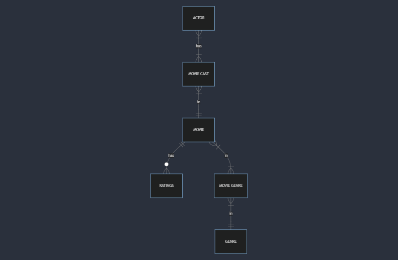

# Design Document

By Lynn Nicole Adhiambo O.

Video overview: [Project Overview](https://youtu.be/4zUZ4Krp3yo)

## Scope

The database for movies includes all entities necessary to facilitate the process of tracking movie information and providing functionality for users to leave their feedback on movie reviews. As such, included in the database's scope is:

* Movies, which includes basic identifying information
* Actors, which includes basic identifying information
* Genres, including basic information about the different movie genres
* Ratings, includes the average rating, the number of ratings and the movie to which the rating is related
* Movie cast, including the role of the actor and the movie on which the acted
* Movie genres, including the connection of a movie to all the available genres in it

Out of scope elements are like directors, shooting locations, production companies, streaming platforms, award nominations and
wins, crew members and any other attributes not directly related to the core entities.

## Functional Requirements

This movie database will support:
* CRUD operations for movies, actors and genres
* Association of movies with more than one genre and managing these associations
* Tracking movie reviews/ratings
* Managing movie cast information for each movie

The system will not support tracking of individual ratings provided by users or detailed rating histories.

## Representation

Entities in the database are captured in SQLite tables with the following schema.

### Entities

The database has the following entities:

#### Movies

The `movies` table includes:

* `id`, which specifies the unique ID for the movie as an `INTEGER`. This column thus has the `PRIMARY KEY` constraint applied.
* `movie_title`, which specifies the title of the movie as `TEXT`, given `TEXT` is appropriate for title fields. A `NOT NULL`
constraint is applied to ensure that all movies have their titles included, since they are all required.
* `date_released`, which specifies when the movie was released, the exact year, month and day. `NUMERIC` is used as timestamps in SQLite can be conveniently stored as such, per SQLite documentation at <https://www.sqlite.org/datatype3.html>.
* `original_language`, which specifies the language used in the original version of a movie as `TEXT`, given `TEXT` is appropriate for language fields. A `NOT NULL` constraint is applied to ensure that all movies have their original languages included, since they are all required.

#### Actors

The `actors` table includes:

* `id`, which specifies the unique ID for an actor as an `INTEGER`. This column thus has the `PRIMARY KEY` constraint applied.
* `first_name`, which specifies the actor's first name as `TEXT`, given `TEXT` is appropriate for name fields.
* `last_name`, which specifies the actor's last name. `TEXT` is used for the same reason as `first_name`.
* `gender`, which specifies the gender of the actor which is either male(M) of female(F). This column is represented with a `TEXT` type affinity.

All columns in the `actors` table are required and hence should have the `NOT NULL` constraint applied. The `gender` column has an additional constraint to check if its value is either male, M, or female, F, given that this is the valid value for a gender.

#### Genres

The `genres` table includes:

* `id`, which specifies the unique ID for a genre as an `INTEGER`. This column thus has the `PRIMARY KEY` constraint applied.
* `genre_name`, which specifies the genre's name as `TEXT`, given `TEXT` is appropriate for genre name fields.

All columns in the `genres` table are required, and hence should have the `NOT NULL` constraint applied. Additionally, the `genre_name` column has the `UNIQUE` constraint since no two genres are expected to have the same name.

#### Ratings

The `ratings` table includes:

* `movie_id`, which is the ID of a movie as an `INTEGER`. This column thus has the `FOREIGN KEY` constraint applied, referencing the `id` column in the `movies` table to ensure data integrity.
* `avg_rating`, which specifies the average rating of a certain movie as `NUMERIC`.
* `rating_count`, which is the total number of ratings that a movie received as `INTEGER`.

#### Movie Cast

The `movie_cast` table includes:

* `id`, which specifies the unique ID for a movie and actor relation with respect to the role as an `INTEGER`. This column thus has the `PRIMARY KEY` constraint applied.
* `movie_id`, which is the ID of a movie as an `INTEGER`. This column thus has the `FOREIGN KEY` constraint applied, referencing the `id` column in the `movies` table to ensure data integrity.
* `actor_id`, which is the ID of the actor who acted in a certain movie as an `INTEGER`. This column thus has the `FOREIGN KEY` constraint applied, referencing the `id` column in the `actors` table to ensure data integrity.
* `role`, which specifies the role that an actor took in the movie in which they acted as `TEXT`.

All columns are required and hence have the `NOT NULL` constraint applied where a `PRIMARY KEY` or `FOREIGN KEY` constraint is not.

#### Movie Genre

The `movie_genre` table includes:

* `movie_id`, which is the ID of a movie as an `INTEGER`. This column thus has the `FOREIGN KEY` constraint applied, referencing the `id` column in the `movies` table to ensure data integrity.
* `genre_id`, which is the ID of the genre of a certain movie as an `INTEGER`. This column thus has the `FOREIGN KEY` constraint applied, referencing the `id` column in the `actors` table to ensure data integrity.

### Relationships

The below entity relationship diagram describes the relationships among the entities in the database.

As detailed by the diagram:

* An actor is associated with one to many movie casts: One, if they acted in only one movie thus one moie cast and many, if the actor was in more than one movie hence many movie casts. At the same time, a movie cast can have one to many actors.
* A movie can have one or many movie cast: One, if the movie has one actor and many, if it has more than one actor. At the same time, a movie cast is associated with only one movie.
* A movie has zero to many ratings. Zero, if the movie has yet to receive any ratings, and many if the movie has received more than one rating. A rating is submitted by more than one user. At the same time, a rating is associated with only one movie.
* A genre can be in one to many movie genres: One, if the genre is in only one movie and many, if it is in more than one movie. At the same time, a movie genre is associated with only one genre.
* A movie can have one to many movie genres. At the same time, a movie genre can have one to many movies: One, if the movie genre is in only one movie and many, if the movie genre is in more than one movie.

## Optimizations

### Indexes
* Index on `movie_title` column in the `movies` table to speed the identification of movies.
* Index on `first_name` and `last_name` columns in the `actors` table for hasten the identification of actors by those columns.
* Index on `movie_id` and `avg_rating` columns in the `ratings` table to speed the identification.
* Index on `movie_id` and `actor_id` columns in the `movie_cast` table to improve query performance when identifying the cast for a specific movie or when searching for movies featuring a specific actor.
* Index on `movie_id` and `genre_id` columns in the `movie_genre` table speed the identification of movies by genre and vice versa.

## Limitations

Other potentially useful entities involved are not represented for instance directors, production companies, movie overview etc. The database does not show information on the availability of the movies on different platforms. The schema has limited information on entities especially the actors and ratings.
